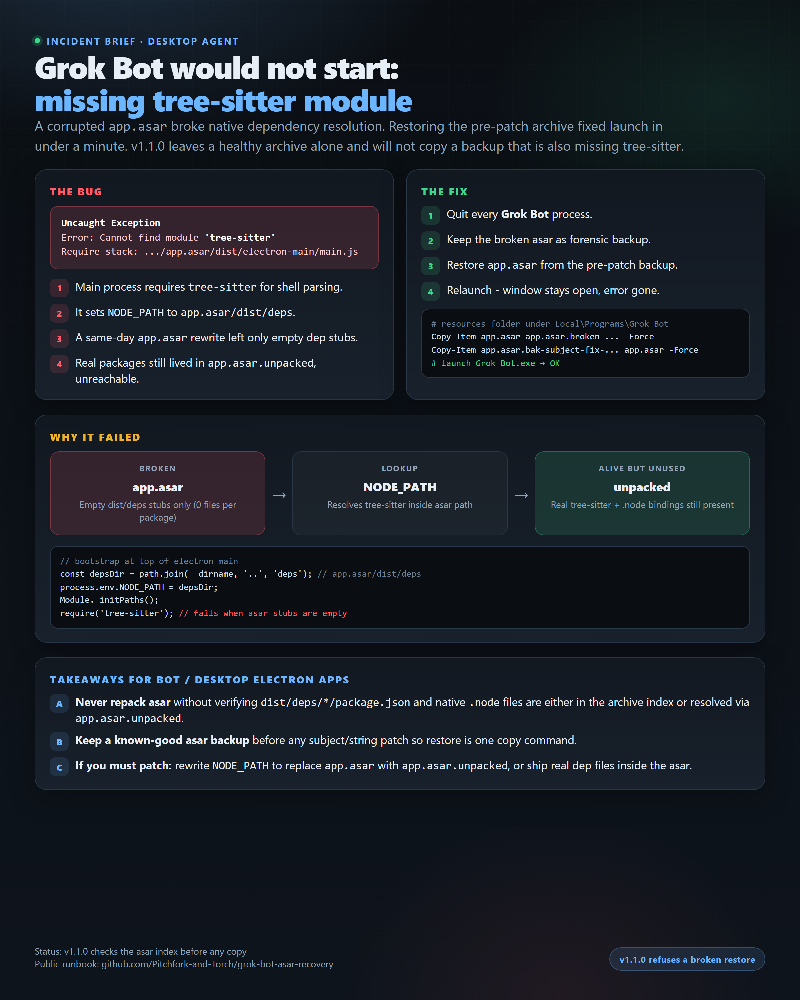

# Grok Bot asar recovery



Recover **Grok Bot** desktop when the main process dies on startup with:

```text
Error: Cannot find module 'tree-sitter'
Require stack: .../app.asar/dist/electron-main/main.js
```

MIT. Not affiliated with xAI / SpaceXAI. Community recovery runbook only.

## What broke

1. Electron main sets `NODE_PATH` to `app.asar/dist/deps` and requires `tree-sitter` (shell parser).
2. Native deps are shipped under `app.asar.unpacked/dist/deps` (real `package.json` + `.node` files).
3. A same-day **`app.asar` rewrite** left only **empty directory stubs** for `dist/deps/*` inside the archive.
4. Module resolution looked inside the broken asar path and failed, even though unpacked packages were still on disk.

```text
[broken app.asar]  empty dist/deps stubs
        |
        v
  NODE_PATH = app.asar/dist/deps
        |
        v
  require('tree-sitter')  -->  MODULE_NOT_FOUND

[app.asar.unpacked]  real tree-sitter still present (unused)
```

## The fix

Restore a **known-good** `app.asar` (pre-patch backup) next to the unpacked tree. Do not delete `app.asar.unpacked`.

v1.1.0 reads the archive header before it copies anything.

- If `dist/deps/tree-sitter/package.json` is already in the current `app.asar` with a size above zero, the script exits and leaves the file alone.
- A backup is eligible only when its header has that same file. A larger file is not preferred just because it is larger.
- Names containing `broken` are never chosen, including `app.asar.broken-before-restore-*`.
- `-CheckOnly` prints the result and changes nothing. Exit 0 means healthy. Exit 2 means the index is missing tree-sitter.
- `-Force` restores even when the current archive is healthy. It still refuses an unhealthy backup.

```powershell
powershell -ExecutionPolicy Bypass -File .\scripts\Restore-GrokBotAsar.ps1 -CheckOnly
powershell -ExecutionPolicy Bypass -File .\scripts\Restore-GrokBotAsar.ps1
```

Manual equivalent, only when you already know the backup is the pre-patch file:

```powershell
$res = Join-Path $env:LOCALAPPDATA 'Programs\Grok Bot\resources'
# stop Grok Bot processes first
Copy-Item (Join-Path $res 'app.asar') (Join-Path $res ("app.asar.broken-" + (Get-Date -Format 'yyyyMMdd-HHmmss'))) -Force
# pick your pre-patch backup name
Copy-Item (Join-Path $res 'app.asar.bak-subject-fix-*') (Join-Path $res 'app.asar') -Force
Start-Process (Join-Path $env:LOCALAPPDATA 'Programs\Grok Bot\Grok Bot.exe')
```

## Safe rules if you patch asar

- Keep a full `app.asar` backup before any edit.
- After repack, confirm either:
  - `dist/deps/tree-sitter/package.json` (and `.node` files) exist in the asar **index**, or
  - main bootstrap resolves `NODE_PATH` to **`app.asar.unpacked\dist\deps`** (replace `app.asar` in the path).
- Empty stub directories alone are not enough for `require('tree-sitter')`.

## Verify

1. Grok Bot window opens and stays open (no "JavaScript error in the main process").
2. Optional: Node can resolve unpacked package:

```powershell
$env:NODE_PATH = Join-Path $env:LOCALAPPDATA 'Programs\Grok Bot\resources\app.asar.unpacked\dist\deps'
node -e "console.log(require.resolve('tree-sitter'))"
```

## Current builds (0.18.0)

Grok Bot **0.18.0** (2026-08-12) ships a complete asar index again:

- `dist/deps/tree-sitter/package.json`
- `dist/deps/tree-sitter/index.js`
- `dist/deps/tree-sitter/build/Release/tree_sitter_runtime_binding.node`

If the window opens and stays open, you do not need this restore. v1.1.0 sees that complete index and does not replace `app.asar`. Keep the script for the next broken rewrite: a future asar patch can still drop empty `dist/deps` stubs.

## Scope

- Windows install path default: `%LOCALAPPDATA%\Programs\Grok Bot`
- Does **not** ship proprietary app binaries
- Does **not** modify bot product source; recovery only

## License

MIT - see [LICENSE](LICENSE).
